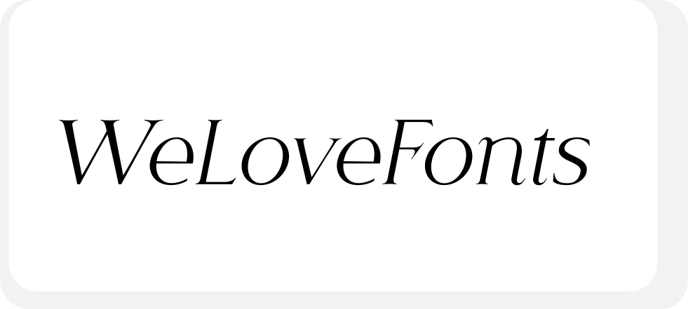

# WeLoveFonts

**WeLoveFonts** is an interactive web app that allows users to transform text typed into an input field into various typographic styles (fonts) such as bold, italic, and more. Inspired by popular tools like CoolFonts, this site makes it easy to copy text with unique formats for use on social media, messaging apps, or any platform that supports styled Unicode characters.

## Features

- Real-time text input: type and see instant transformation.
- Multiple styled fonts: Bold, Italic, Small Caps, and others.
- Copy button for easy clipboard copying of styled text.
- Clean and simple user interface.
- Light and dark theme toggle.
- Compatible with most modern browsers.

## Demo

Check out the site at: (https://we-love-fonts-js.vercel.app/)

## Technologies Used

- Vue 3 with `<script setup>`
- TypeScript
- TailWind and CSS for styling and dark mode
- Clipboard API for copying text
- Vercel for deployment and hosting

## Usage

1. Type the text you want to transform into the input field.
2. See the text displayed in different styles below.
3. Click the copy button next to the desired font to copy the styled text to your clipboard.
4. Paste the copied text wherever you want.

## Contributions

Contributions are welcome! Feel free to open issues or pull requests to suggest improvements or report bugs.

## License

MIT License © 2025 David Mejías
